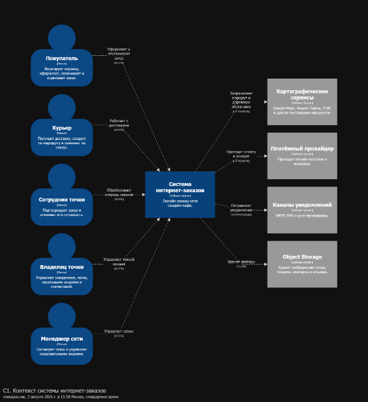
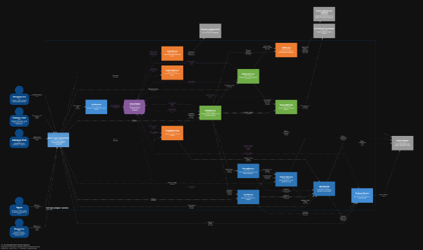

# Архитектура интернет-магазина «I'll Have the BLT»

Решение домашнего задания по декомпозиции системы интернет-заказов национальной сети сэндвич-кафе на микросервисы.

## Состав решения

| Раздел | Содержимое |
|---|---|
| [Пользовательские сценарии](./Пользовательские%20сценарии/) | Сценарии покупателя, курьера, сотрудника точки продаж, владельца и менеджера сети |
| [Микросервисы](./Микросервисы/) | Назначение, зона ответственности, данные, правила, API и события каждого сервиса |
| [Контракты](./Контракты/) | Сводные синхронные и асинхронные контракты взаимодействия |
| [C4](./C4/) | Контейнерная C4-диаграмма и исходники Structurizr DSL |

## Результат декомпозиции

Система разделена на бизнес-возможности: управление доступом, клиентами, точками продаж, товарами, корзиной, ценами и акциями, заказами, платежами, доставкой, маршрутами, отзывами, уведомлениями и аналитикой.

Каждый сервис владеет своей моделью и изменяет собственные данные. Межсервисное взаимодействие выполняется через HTTP-команды и доменные события.

## C4-модель

### C1. Контекст системы

На контекстной диаграмме показаны акторы, граница системы интернет-заказов и внешние интеграции.

### C2. Взаимодействие микросервисов

Контейнерная диаграмма показывает микросервисы, синхронные HTTP-вызовы, асинхронные события и внешние системы.

Исходники диаграмм и инструкция запуска находятся в каталоге [C4](./C4/).
