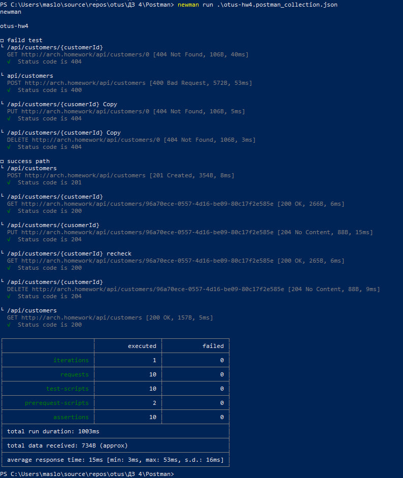

# Postman

Коллекция Postman для тестирования CRUD API сервиса CustomerService.

## Коллекция

otus-hw4.postman_collection.json


:contentReference[oaicite:0]{index=0}

## Покрытие

Коллекция содержит:

- создание пользователя (POST)
- получение пользователя (GET)
- обновление пользователя (PUT)
- удаление пользователя (DELETE)
- негативные сценарии (ошибки 400, 404)

## Базовый URL

http://arch.homework

## Запуск через Newman

```bash
newman run otus-hw4.postman_collection.json
```
## Результат выполнения Newman

