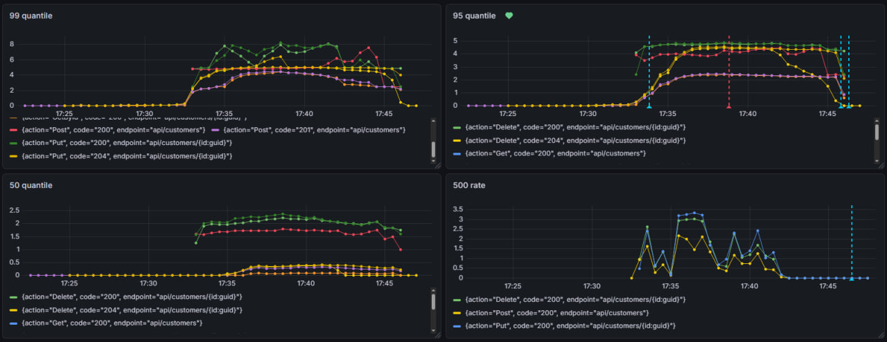
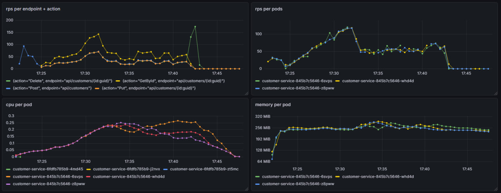
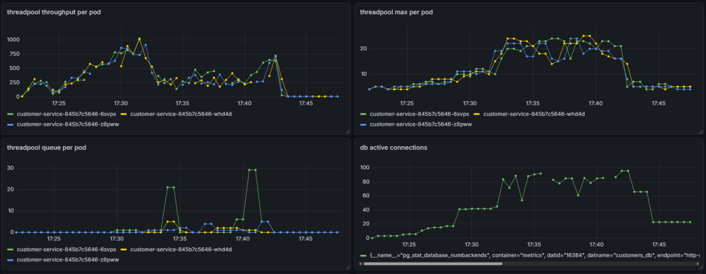
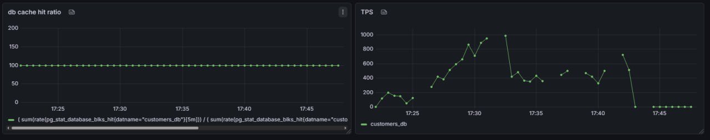
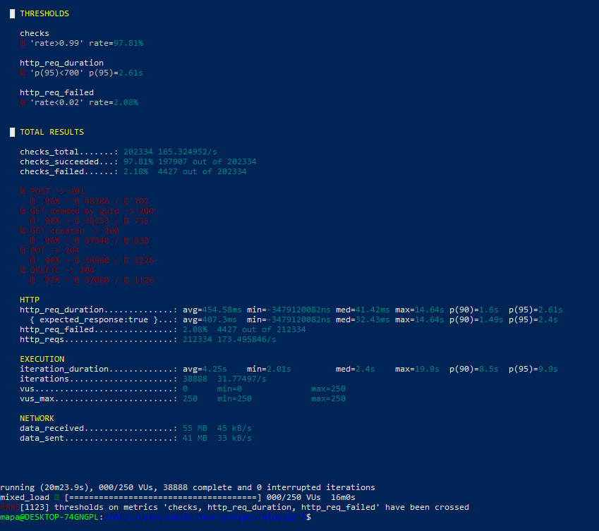

# ДЗ 5 — Prometheus. Grafana

## Цель

В этом ДЗ вы научитесь инструментировать сервис.  
Инструментировать сервис из прошлого задания метриками в формате Prometheus с помощью библиотеки для вашего фреймворка и ЯП..

## Helm

Расширился Helm из [ДЗ 4] (../ДЗ%204/K8s/)

Добавлена инструкция по Prometheus и модифицированны файлы

## Приложение

Добавлена работа с Prometheus [Program] (../ДЗ%204/CustomerService/CustomerService.Api/Program.cs)

## Dashboard

Настроен Dashboard и Alert в Grafana

- [Dashboard] (./Dashboard/)

## Тестирование

Проведенно тестирование при помощи иструмента K6

### Установка K6

```bash
sudo apt update
sudo apt install -y gnupg ca-certificates

sudo gpg -k
curl -fsSL https://dl.k6.io/key.gpg | sudo gpg --dearmor -o /usr/share/keyrings/k6-archive-keyring.gpg

echo "deb [signed-by=/usr/share/keyrings/k6-archive-keyring.gpg] https://dl.k6.io/deb stable main" | sudo tee /etc/apt/sources.list.d/k6.list

sudo apt update
sudo apt install k6
```

### Запуск 

```bash
k6 run K6/customers-crud.js
```

Тестирование проводилось при **10000** записей бд и нарастающим числом пользователь в плоть до **250**

План тестирования:

```json
{
	{ duration: '2m', target: 50 },
	{ duration: '2m', target: 100 },
	{ duration: '2m', target: 150 },
	{ duration: '2m', target: 200 },
	{ duration: '2m', target: 250 },
	{ duration: '6m', target: 250 }
}
```

### Результаты

Результаты представлены в виде фото Dashboard и консоли K6






