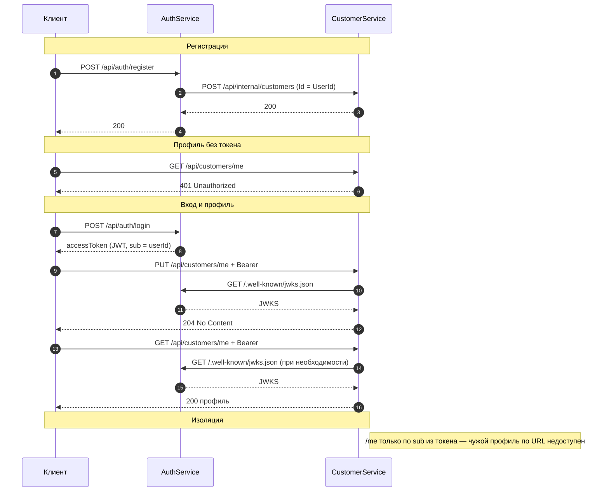

# ДЗ 6 — Аутентификация и защита API

## Цель

Выделить сервис аутентификации, выдавать доступ по JWT, защитить внешние операции с профилем клиента. Исходный код сервисов не хранится в этой папке: он вынесен в каталог [HwApp](../HwApp/).

## 0. Архитектурное решение

**Компоненты.** Клиент обращается к одному хосту (`arch.homework`); Ingress по префиксу пути направляет трафик на **AuthService** (`/api/auth`, `/.well-known`) или **CustomerService** (`/api/customers`). У каждого сервиса своя БД в общем PostgreSQL.

**Регистрация.** AuthService создаёт пользователя, вызывает внутренний API CustomerService (`POST /api/internal/customers`) с идентификатором клиента, совпадающим с идентификатором пользователя, затем активирует учётную запись.

**Профиль.** Чтение и изменение данных только у маршрутов `GET/PUT /api/customers/me`: идентификатор субъекта берётся из JWT (`sub`), а не из URL. Другой пользователь не может запросить профиль первого по «чужому» пути — такого внешнего API нет. CustomerService проверяет подпись и срок JWT; ключи запрашивает у AuthService по `GET /.well-known/jwks.json` **внутри кластера** (Service → Service).

**Cхема.**



## 1. Установка

Namespace: **`homework`**. Отдельный API-gateway не используется: внешняя точка входа — **ingress-nginx** (см. [K8s/README.md](./K8s/README.md)).

```bash
kubectl create namespace homework
# далее PostgreSQL и chart homework-apps — пошагово в K8s/README.md
```

## Структура каталога

| Каталог | Содержимое |
|---------|------------|
| [HwApp](../HwApp/) | Реализация AuthService и CustomerService |
| [K8s](./K8s/) | Развёртывание в Kubernetes (Helm) |
| [Postman](./Postman/) | Коллекция и окружение для проверки сценариев |

## Документация по частям

- [Приложения (HwApp)](../HwApp/README.md) — состав решения, ссылки на README сервисов.
- [Kubernetes и Helm](./K8s/README.md) — ingress, PostgreSQL, chart `homework-apps`.
- [Postman](./Postman/README.md) — запуск тестов (Newman), примеры результатов.

## Реализовано

### AuthService

- Регистрация и вход: `POST /api/auth/register`, `POST /api/auth/login`.
- Выдача JWT (подпись RS256), публикация JWKS: `GET /.well-known/jwks.json`.
- Метаданные OpenID: `GET /.well-known/openid-configuration`.
- При регистрации создание записи клиента во внешнем API (CustomerService) и активация пользователя после успешного создания.

### CustomerService

- Валидация JWT для защищённых маршрутов.
- Профиль текущего пользователя: `GET /api/customers/me`, `PUT /api/customers/me` (идентификатор из токена).
- Внутренний API для вызовов из AuthService при регистрации.

### Инфраструктура

- Один экземпляр PostgreSQL (Bitnami), две БД и пользователя (init-скрипт).
- Helm chart `homework-apps`: два Deployment, миграции Job, Service, Ingress с префиксами `/api/auth`, `/.well-known`, `/api/customers`.
- ServiceMonitor для метрик CustomerService (при включённом Prometheus-стеке в кластере).

### Тестирование

- Postman-коллекция: регистрация двух пользователей, негативные сценарии, логин, работа с профилем по токену.
