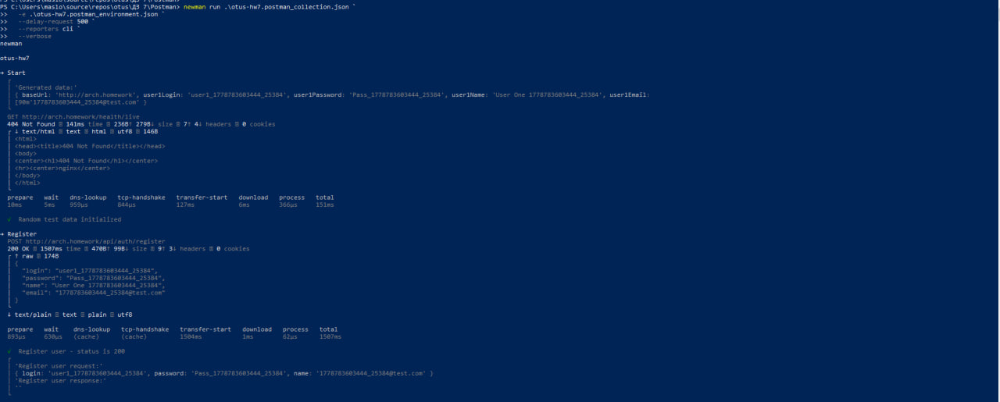
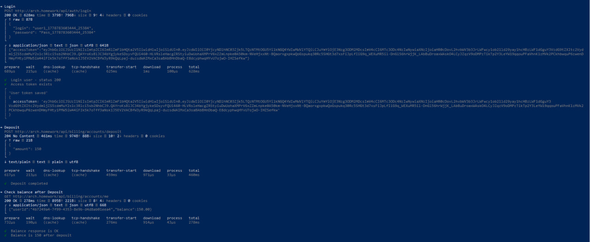
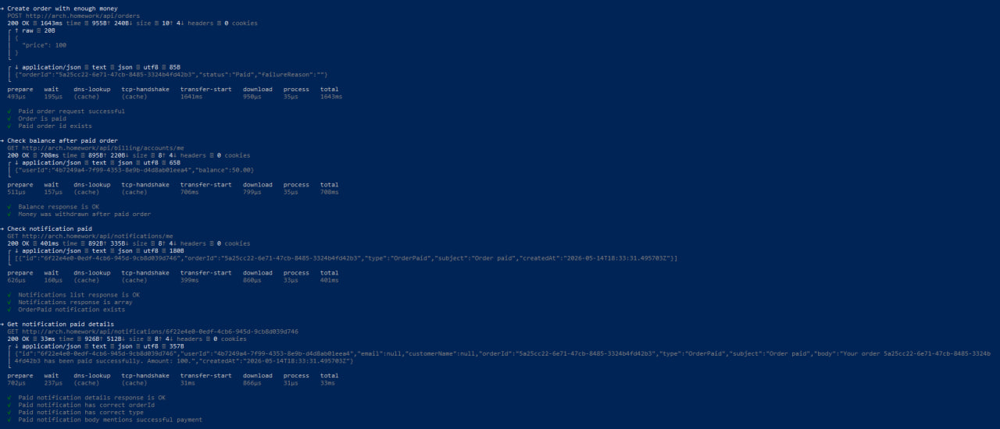
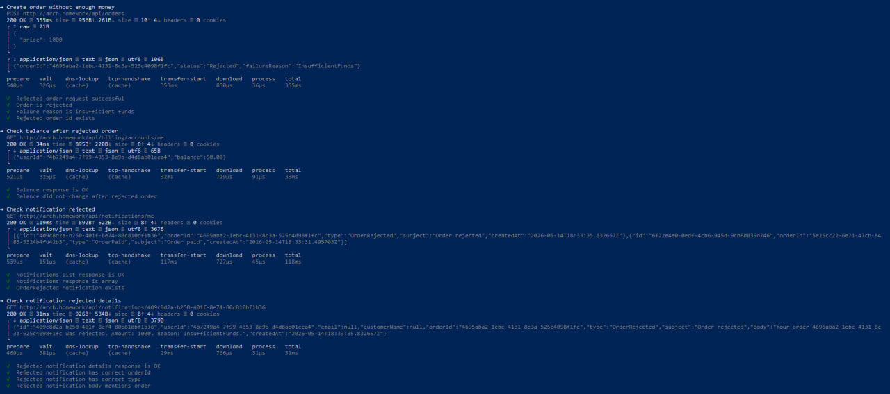
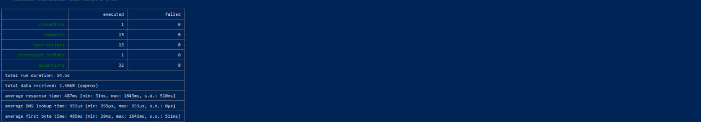

# Postman — ДЗ 7

Коллекция **одним прогоном** закрывает сценарий из задания (регистрация, депозит, заказ с деньгами, проверки, заказ без денег, проверки). Ниже — **один** запуск Newman; фото `photo_1.jpg` … `photo_5.jpg` — **фрагменты вывода этого же прогона** в консоли (не пять отдельных прогонов).

## Файлы

| Файл | Назначение |
|------|------------|
| `otus-hw7.postman_collection.json` | Запросы и тесты |
| `otus-hw7.postman_environment.json` | **`baseUrl`** (по умолчанию `http://arch.homework`), переменные сценария |

Hosts / Ingress: [K8s/README.md](../K8s/README.md).

## Newman

Каталог: **`ДЗ 7/Postman`**. Для задания нужен **`--verbose`**; **`--delay-request`** — по желанию, если кластер отвечает с задержкой.

**PowerShell**

```powershell
newman run .\otus-hw7.postman_collection.json `
  -e .\otus-hw7.postman_environment.json `
  --delay-request 200 `
  --reporters cli `
  --verbose
```

**Bash**

```bash
newman run otus-hw7.postman_collection.json \
  -e otus-hw7.postman_environment.json \
  --delay-request 200 \
  --reporters cli \
  --verbose
```

## Скриншоты (один прогон)










