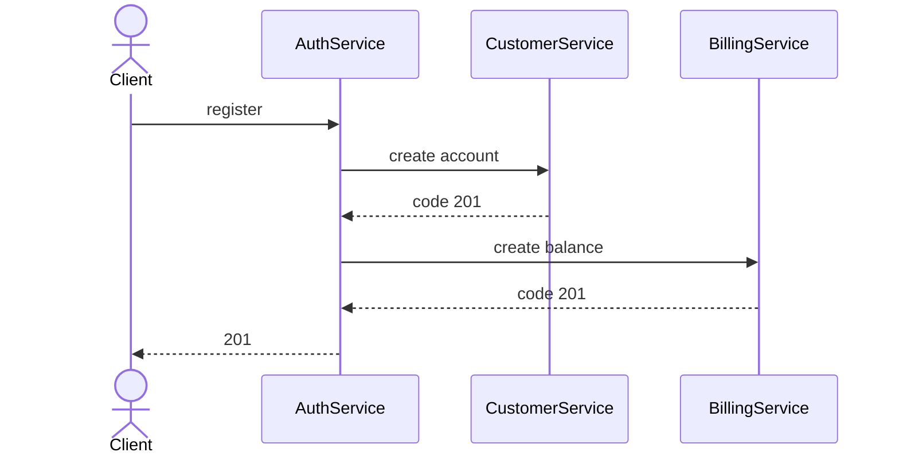
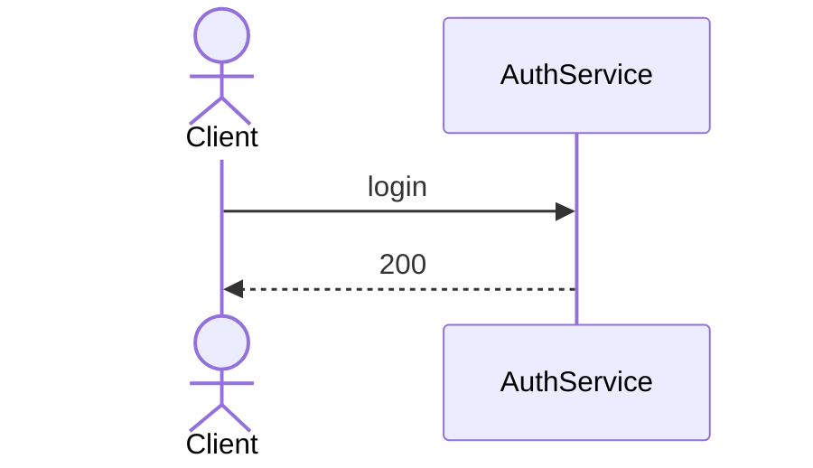
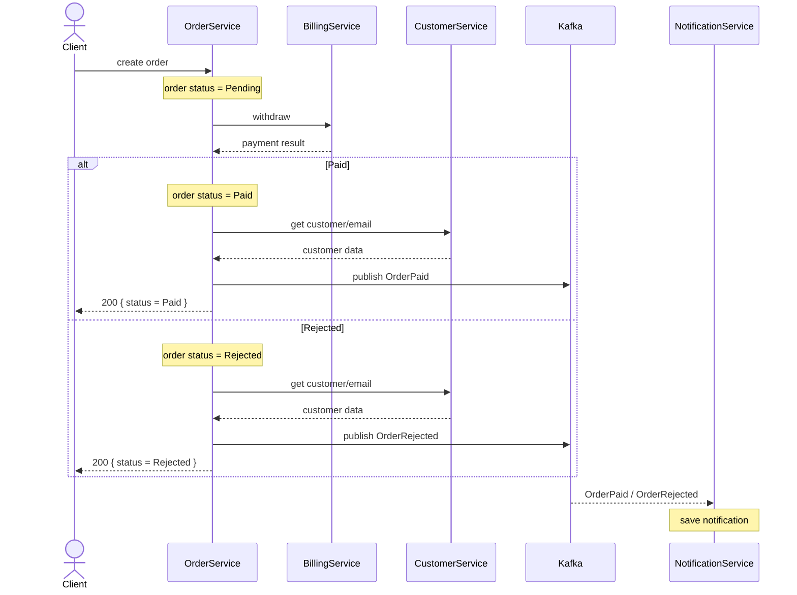

Бизнес-операции выполняются синхронно по HTTP, a NotificationService получает события о результатах заказа через Kafka

## Регистрация
AuthService выступает оркестратором при регистрации: он вызывает CustomerService и BillingService напрямую.

### Diagram



### IDL

```IDL
register. POST /api/auth/register  
	Request:  
	{  
		login: string,
		password: string,
		name: string,
		email: string  
	}  
  
	Response:  {  }  
  
create account. POST /api/internal/customers
	Request:  
	{  
		userId: guid  
		name: string,
		email: string    
	}  
	  
	Response:  {  }  
	  
create balance. POST /api/internal/billing/accounts 
	Request:  
	{  
		userId: guid     
	}  
	  
	Response:  {  }
```


## Вход

AuthService отвечает полностью за вход.

### Diagram



### IDL

```IDL
login. POST /api/auth/login  
	Request:  
	{  
		login: string,
		password: string
	}  
  
	Response:  
	{  
		accessToken: string
	}  
```
## Создание заказа

OrderService вызывает напрямую BillingService и CustomerService, так же публикует событие для NotificationService 

### Diagram



### IDL

```IDL
create order. POST /api/orders
	Request:  
		Headers:
		{
			Authorization: Bearer <accessToken>
		}
		Body:
		{  
			price: number  
		}  
  
	Response:  
	{  
		orderId: guid,  
		status: "Paid" | "Rejected",
		failureReason: "InsufficientFunds" | null  
	} 
	  
withdraw. POST /api/internal/billing/accounts/withdraw
	Request:  
	{  
		amount: number,
		orderId: guid,
		userId: guid
	}  
  
	Response:  
	{  
		status: "Success" | "InsufficientFunds"
	}
	
get customer/email: GET /api/internal/customers/{id}  
	Response:  
	{  
		userId: guid,  
		name: string,
		email: string  
	}
	
Event: OrderPaid  
	Payload:  
	{  
		orderId: guid,  
		userId: guid,  
		email: string,
		price: number  
	}
Event: OrderRejected  
	Payload:  
	{  
		orderId: guid,  
		userId: guid,  
		price: number,  
		email: string,
		failureReason: "InsufficientFunds"  
	}
```