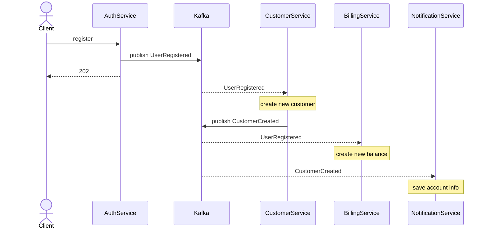
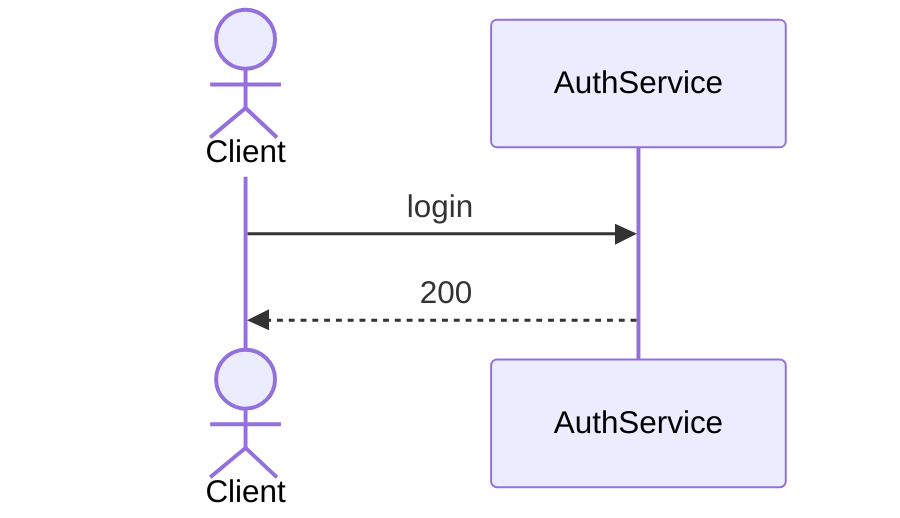
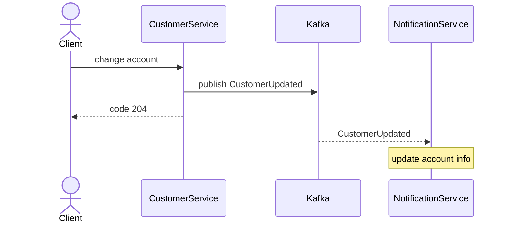
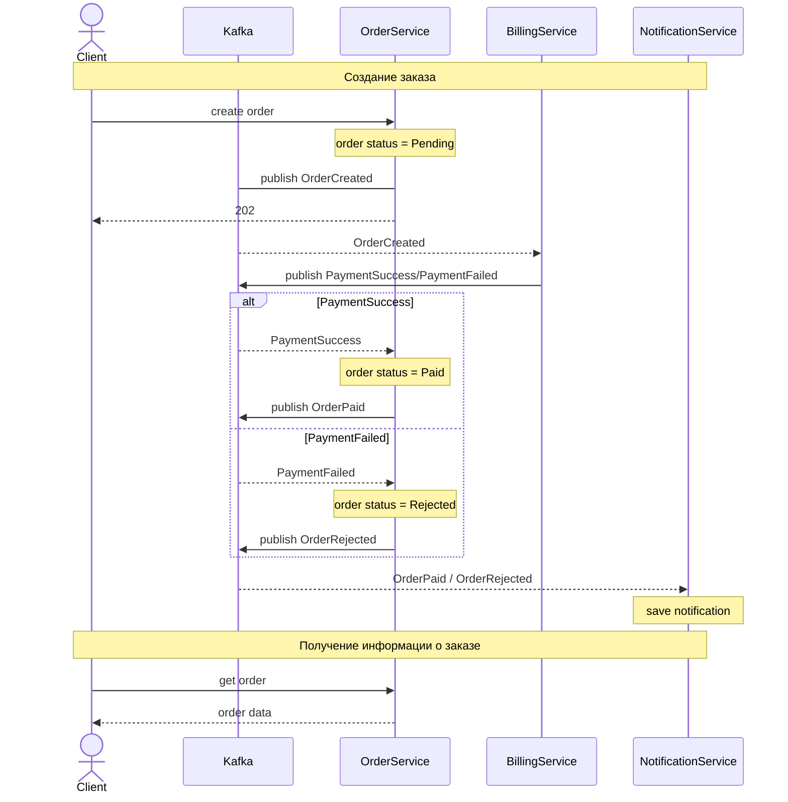

Бизнес-операции выполняются асинхронно через Kafka. HTTP используется только для приёма команд и чтения итогового состояния.

## Регистрация

AuthService публикует событие о регистрации нового пользователя в Kafka, которые обрабатывают CustomerService и BillingService
CustomerService публикует событие о создании нового пользователя

### Diagram



### IDL

```IDL
register. POST /api/auth/register  
	Request:  
	{  
		login: string,
		password: string,
		name: string,
		email: string  
	}  
  
	Response:  {  }  
  
Event: UserRegistered
	Payload:  
	{  
		userId: guid  
		name: string,
		email: string    
	} 
	
Event: CustomerCreated
	Payload:  
	{  
		userId: guid  
		name: string  
		email: string  
	}
```


## Вход

AuthService отвечает полностью за вход.

### Diagram



### IDL

```IDL
login. POST /api/auth/login  
	Request:  
	{  
		login: string,
		password: string
	}  
  
	Response:  
	{  
		accessToken: string
	}  
```

## Редактирование пользователя

CustomerService публикует событие о изменение пользователя

### Diagram



### IDL

```IDL
create account. PUT /api/customers/me 
	Request:  
		Headers:
		{
			Authorization: Bearer <accessToken>
		}
		Body:
		{  
			name: string,
			email: string,
			dateOfBirth: date | null     
		}  

	Response:  {  }  
	
Event: CustomerUpdated
	Payload:  
	{  
		userId: guid  
		name: string  
		email: string  
	}
```
## Создание заказа

OrderService публикует события, которые обрабатывает BillingService и NotificationService через Kafka 

### Diagram



### IDL

```IDL
create order. POST /api/orders
	Request:  
		Headers:
		{
			Authorization: Bearer <accessToken>
		}
		Body:
		{  
			price: number  
		}  
  
	Response:  
	{  
		orderId: guid,  
		status: "Pending"
	} 
	  
Event: OrderCreated
	Payload:  
	{  
		price: number,
		orderId: guid,
		userId: guid
	}  
	
Event: PaymentSuccess
	Payload:  
	{  
		orderId: guid
	}

Event: PaymentFailed
	Payload:
	{
		orderId: guid,
		reason: "InsufficientFunds"
	}
	
Event: OrderPaid  
	Payload:  
	{  
		orderId: guid,  
		userId: guid,  
		price: number  
	}
Event: OrderRejected  
	Payload:  
	{  
		orderId: guid,  
		userId: guid,  
		price: number,  
		failureReason: "InsufficientFunds"  
	}
	
get order. GET /api/orders/{id}
	Request:  
		Headers:
		{
			Authorization: Bearer <accessToken>
		} 
  
	Response:  
	{  
		orderId: guid,  
		status: "Paid" | "Rejected" | "Pending",
		failureReason: "InsufficientFunds" | null  
	} 
```