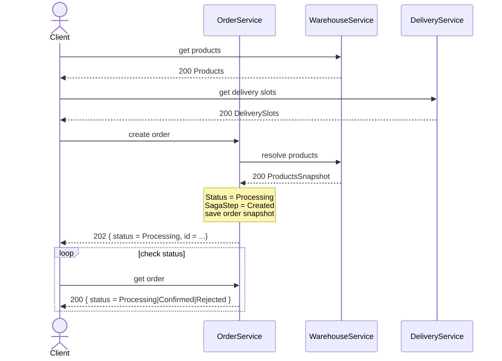
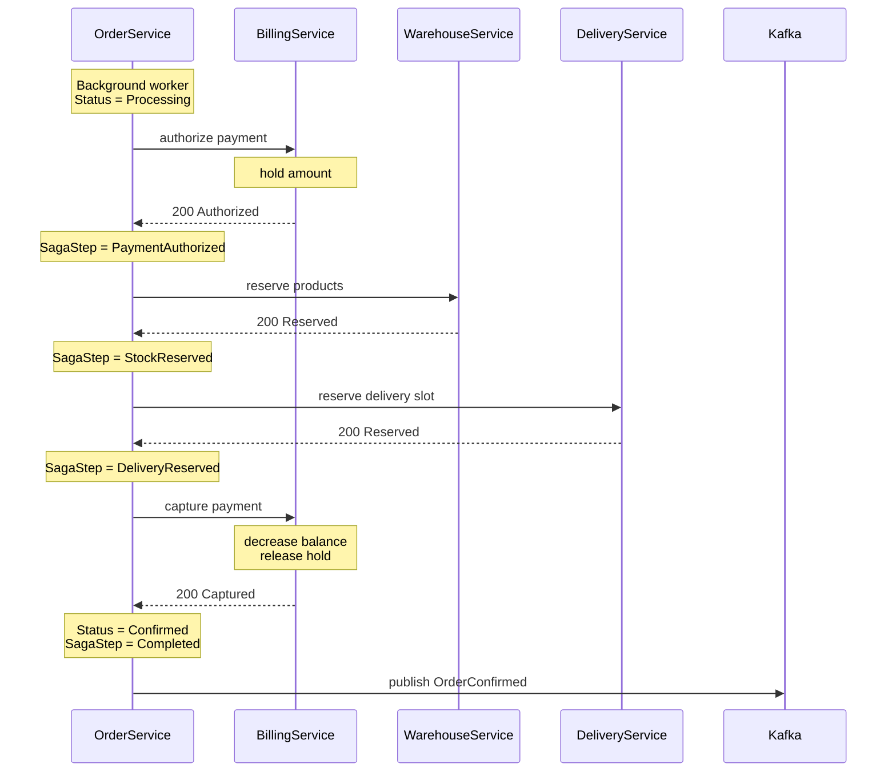
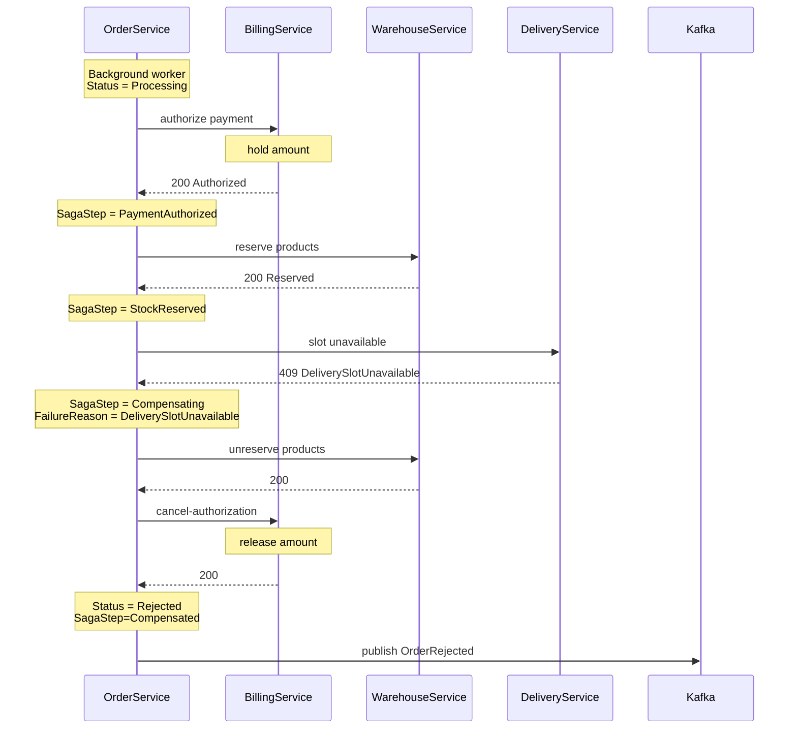

**См. также:** [оглавление](./README.md) · [виды реализации (обзор вариантов)](./Виды%20реализации%20распределенной%20транзакции.md) · [аргументация выбора](./Аргументация%20выбора%20Saga%20Orchestration%20через%20background%20worker%20и%20HTTP-команды.md)

---

Для распределённой транзакции используется паттерн Saga Orchestration. Каждый участник Saga выполняет локальную транзакцию и предоставляет компенсирующую операцию. Команды между сервисами выполняются синхронно по HTTP.

### Участники Saga

| Сервис              | Роль                 | Основные действия                                         | Компенсации           |
| ------------------- | -------------------- | --------------------------------------------------------- | --------------------- |
| OrderService        | Оркестратор          | создаёт заказ, хранит состояние Saga, вызывает участников | запускает компенсации |
| BillingService      | Участник Saga        | authorize payment, capture payment                        | cancel-authorization  |
| WarehouseService    | Участник Saga        | resolve products, reserve products                        | cancel reservation    |
| DeliveryService     | Участник Saga        | reserve delivery slot                                     | cancel reservation    |
| NotificationService | Подписчик на события | получает `OrderConfirmed` / `OrderRejected`               | не участвует в Saga   |

Все внутренние команды Saga являются идемпотентными по orderId. Повторный вызов authorize/reserve/capture/cancel для того же orderId не должен создавать повторные списания, резервы или отмены.

## Создание заказа

OrderService вызывает напрямую BillingService, WarehouseService и DeliveryService, а также публикует событие для NotificationService 

### Работа с внешним API

Внешний API используется клиентом для выбора товаров, выбора слота доставки, создания заказа и последующего polling статуса. При создании заказа OrderService получает snapshot товаров и цены из WarehouseService, сохраняет заказ в статусе Processing и возвращает 202 Accepted. Дальнейшее выполнение Saga происходит в background worker.

#### Diagram



#### IDL

##### get products. GET /api/warehouse/products
```IDL
Request:    
	Headers:    
		{        
			Authorization: Bearer <accessToken>    
		} 

Response: 200 OK
	Body
	{
	    items: [
	        {
	            productId: guid,
	            name: string,
	            unitPrice: number,
	            availableQuantity: number
	        }
	    ]
	}
```

##### get delivery slots. GET /api/delivery/slots
```IDL
Request:    
	Headers:    
		{        
			Authorization: Bearer <accessToken>    
		} 

Response: 200 OK
	Body
	{
	    items: [
	        {
	            slotId: guid,
	            timeFrom: DateTime,
	            timeTo: DateTime,  
				status: "Available" | "Reserved"
	        }
	    ]
	}
```
##### create order. POST /api/orders
``` IDL
Request:    
	Headers:    
		{        
			Authorization: Bearer <accessToken>    
		}    
		Body:    
		{        
			items: [            
				{                
					productId: guid,                
					quantity: number            
				}       
			],        
			deliverySlotId: guid    
		}
Response: 202 Accepted
	Body:   
	{    
		id: guid,    
		status: "Processing"
	}
```

##### get order. GET /api/orders/{id}

SagaStep возвращается во внешнем API только для демонстрации работы Saga в рамках ДЗ

```IDL
Request:  
	Headers:  
	{  
		Authorization: Bearer <accessToken>  
	}  
  
Response: 200 OK
	Body:   
	{  
		id: guid,  
		status: "Processing" | "Confirmed" | "Rejected",  
		sagaStep: "Created" | "PaymentAuthorized" | "StockReserved" | "DeliveryReserved" | "Completed" | "Compensating" | "Compensated",  
		totalAmount: number,  
		items: [  
			{  
				productId: guid,  
				name: string,  
				unitPrice: number,  
				quantity: number,  
				totalPrice: number  
			}  
		],  
		deliverySlotId: guid,  
		failureReason: "InsufficientFunds" | "StockNotAvailable" | "DeliverySlotUnavailable" | null  
	}
```

##### resolve products. POST /api/internal/warehouse/products/resolve
```IDL
Request:
	Body
	{
	    items: [
	        {
	            productId: guid,
	            quantity: number
	        }
	    ]
	}

Response: 200 OK
	Body
	{
	    items: [
	        {
	            productId: guid,
	            name: string,
	            unitPrice: number,
	            quantity: number,
	            totalPrice: number
	        }
	    ],
	    totalAmount: number
	}
```


### Работа Background worker. Успешное создание заказа

Background worker в OrderService выбирает заказы в статусе Processing и выполняет шаги Saga. После каждого успешного шага OrderService сохраняет прогресс в SagaStep, чтобы после падения продолжить обработку с последнего успешно завершённого шага.

#### Diagram



#### IDL

##### authorize payment. POST /api/internal/billing/payments/authorize
```IDL
Request:
	Body
	{
	    orderId: guid,
	    userId: guid,
	    amount: number
	}

Response: 200 OK
	Body
	{
	    paymentId: guid,
	    authorizedAmount: number
	}
```

##### reserve products. POST /api/internal/warehouse/reservations

```IDL 
Request:
	Body
	{
	    orderId: guid,
	    userId: guid,
	    items: [
	        {
	            productId: guid,
	            quantity: number
	        }
	    ]
	}

Response: 200 OK
	Body
	{
	    reservationId: guid
	}
```

##### reserve delivery slot. POST /api/internal/delivery/reservations

```IDL
Request:
	Body
	{
	    orderId: guid,
	    userId: guid,
	    deliverySlotId: guid
	}

Response: 200 OK
	Body
	{
	    reservationId: guid
	}
```

##### capture payment. POST /api/internal/billing/payments/capture

```IDL
Request:  
	Body:
	{  
		orderId: guid  
	}  
  
Response: 200 OK
	Body:
	{  
		paymentId: guid,  
		capturedAmount: number  
	}
```

##### Event: OrderConfirmed

```IDL
Payload:
{
    eventId: guid,
    orderId: guid,
    userId: guid,
    totalAmount: number,
    items: [
        {
            productId: guid,
            name: string,
            unitPrice: number,
            quantity: number,
            totalPrice: number
        }
    ],
    deliverySlotId: guid,
    occurredAt: datetime
}
```
#### Состояния Saga

| SagaStep | Значение | Следующее действие |
|---|---|---|
| Created | Заказ создан, Saga ещё не выполнила ни одного бизнес-шагa | authorize payment |
| PaymentAuthorized | Платёж авторизован, сумма захолдирована | reserve products |
| StockReserved | Товары зарезервированы | reserve delivery slot |
| DeliveryReserved | Слот доставки зарезервирован | capture payment |
| Completed | Все шаги успешно выполнены | финальное состояние |
| Compensating | Выполняется компенсация уже выполненных шагов | cancel completed steps |
| Compensated | Компенсация завершена | финальное состояние |

### Работа Background worker. Неудачное создание заказа

Компенсация запускается после ошибки на любом шаге, перед которым уже были успешно выполнены компенсируемые действия. Если ошибка произошла на первом шаге authorize payment, компенсировать ещё нечего.

Технические ошибки 5xx/timeout не переводят заказ сразу в Rejected. В этом случае заказ остаётся в Processing, а worker повторяет текущий шаг позже. Бизнес-ошибки 409 запускают компенсацию уже выполненных шагов.
#### Diagram



#### IDL
##### authorize payment. POST /api/internal/billing/payments/authorize

Успех: 
```IDL
Request:
	Body
	{
	    orderId: guid,
	    userId: guid,
	    amount: number
	}

Response: 200 OK
	Body
	{
	    paymentId: guid,
	    authorizedAmount: number
	}
```

Ошибка:
```IDL
Response: 409 Conflict
    Body:
    {
        errorCode: "InsufficientFunds"
    }
```

##### reserve products. POST /api/internal/warehouse/reservations

Успех:
```IDL 
Request:
	Body
	{
	    orderId: guid,
	    userId: guid,
	    items: [
	        {
	            productId: guid,
	            quantity: number
	        }
	    ]
	}

Response: 200 OK
	Body
	{
	    reservationId: guid
	}
```

Ошибка:
```IDL
Response: 409 Conflict
    Body:
    {
        errorCode: "StockNotAvailable",
        unavailableItems: [
            {
                productId: guid,
                requestedQuantity: number,
                freeQuantity: number
            }
        ]
    }
```
##### reserve delivery slot. POST /api/internal/delivery/reservations

Успех:
```IDL
Request:
	Body
	{
	    orderId: guid,
	    userId: guid,
	    deliverySlotId: guid
	}

Response: 200 OK
	Body
	{
	    reservationId: guid
	}
```

Ошибка
```IDL
Response: 409 Conflict  
	Body:  
	{  
		errorCode: "DeliverySlotUnavailable"  
	}
```

##### unreserve products. POST /api/internal/warehouse/reservations/cancel

```IDL 
Request:
	Body
	{
	    orderId: guid
	}

Response: 200 OK
```

##### cancel-authorization. POST /api/internal/billing/payments/cancel-authorization
```IDL
Request:
	Body
	{
	    orderId: guid
	}

Response: 200 OK
```

##### Event: OrderRejected

```IDL
Payload:
{
    eventId: guid,
    orderId: guid,
    userId: guid,
    totalAmount: number,
    items: [
        {
            productId: guid,
            name: string,
            unitPrice: number,
            quantity: number,
            totalPrice: number
        }
    ],
    deliverySlotId: guid,
    occurredAt: datetime,  
	failureReason: "InsufficientFunds" | "StockNotAvailable" | "DeliverySlotUnavailable"
}
```

#### Правила компенсации

| Где произошла бизнес-ошибка | Уже выполнено                                            | Компенсация                                                                      | Финальный статус |
| --------------------------- | -------------------------------------------------------- | -------------------------------------------------------------------------------- | ---------------- |
| `authorize payment`         | ничего                                                   | не требуется                                                                     | `Rejected`       |
| `reserve products`          | payment authorized                                       | `cancel-authorization`                                                           | `Rejected`       |
| `reserve delivery slot`     | payment authorized, products reserved                    | `cancel reservation` в WarehouseService, `cancel-authorization` в BillingService | `Rejected`       |
| `capture payment`           | payment authorized, products reserved, delivery reserved | не переводить заказ в `Rejected`, повторить `capture` позже                      | `Processing`     |
|                             |                                                          |                                                                                  |                  |
#### Обработка ошибок

| Тип ошибки | Пример | Действие |
|---|---|---|
| Бизнес-ошибка | `409 InsufficientFunds` | перевести заказ в `Rejected`, компенсация не требуется |
| Бизнес-ошибка | `409 StockNotAvailable` | отменить авторизацию платежа, перевести заказ в `Rejected` |
| Бизнес-ошибка | `409 DeliverySlotUnavailable` | отменить резерв товара, отменить авторизацию платежа, перевести заказ в `Rejected` |
| Техническая ошибка | `5xx`, timeout, network error | оставить заказ в `Processing`, повторить текущий шаг позже |