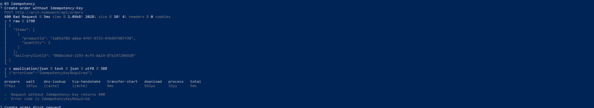
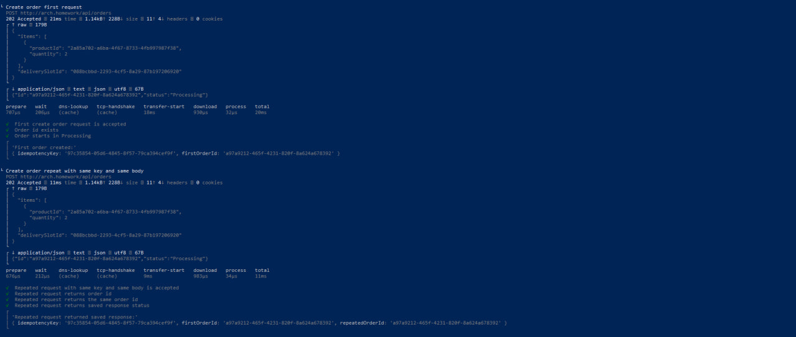
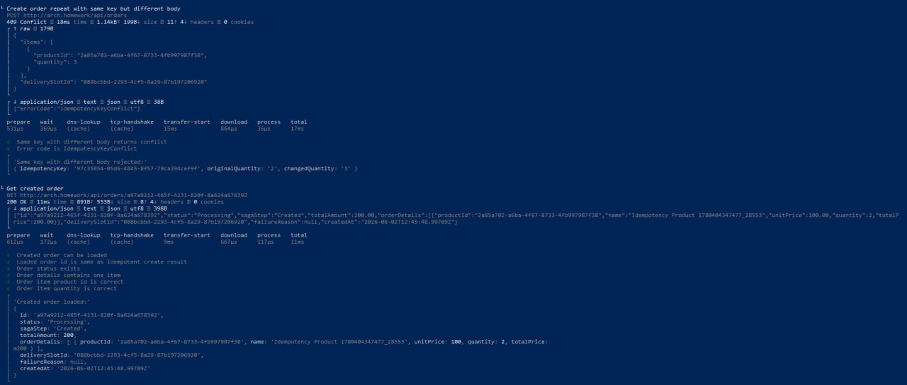
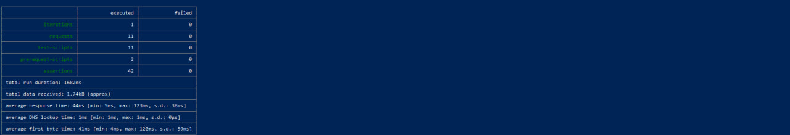

# Postman — ДЗ 9

Коллекция проверяет **идемпотентное создание заказа** (повтор с тем же `Idempotency-Key`, конфликт при смене тела и т.д. — по сценарию коллекции). В окружении **`baseUrl`** по умолчанию задан как **`http://arch.homework`** (требование задания для `{{baseUrl}}`).

## Файлы

| Файл | Назначение |
|------|------------|
| `otus-hw9.postman_collection.json` | Запросы и тесты |
| `otus-hw9.postman_environment.json` | **`baseUrl`** и переменные сценария |

Hosts / Ingress / namespace: [K8s/README.md](../K8s/README.md).

## Newman

Каталог: **`ДЗ 9/Postman`**. Для отчёта удобно использовать **`--verbose`**; **`--delay-request`** — по желанию, если кластер или сага отвечают с задержкой.

**PowerShell**

```powershell
newman run .\otus-hw9.postman_collection.json `
  -e .\otus-hw9.postman_environment.json `
  --delay-request 300 `
  --reporters cli `
  --verbose
```

**Bash**

```bash
newman run otus-hw9.postman_collection.json \
  -e otus-hw9.postman_environment.json \
  --delay-request 300 \
  --reporters cli \
  --verbose
```

## Скриншоты / записи








