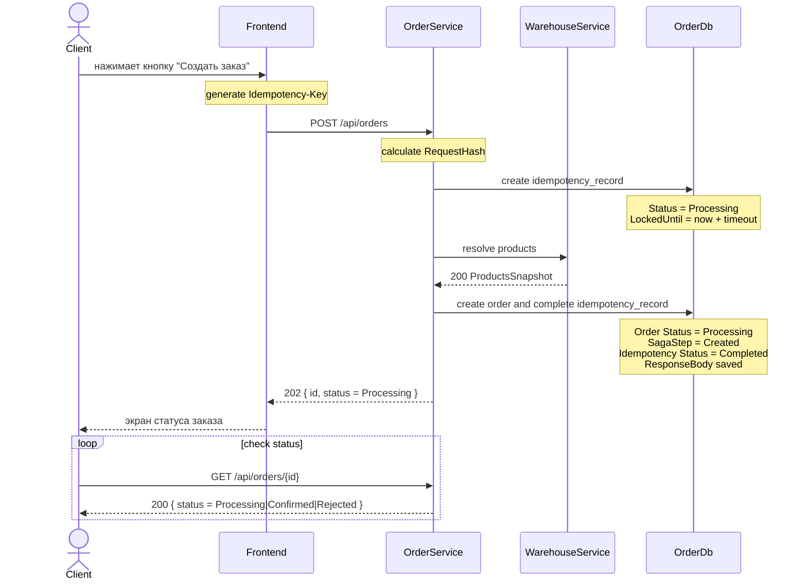

## Идемпотентность создания заказа

Для идемпотентности создания заказа используется паттерн Idempotency Key.  
  
Клиент передаёт уникальный ключ в header `Idempotency-Key` при вызове `POST /api/orders`.  
OrderService сохраняет ключ, hash тела запроса и результат обработки в таблицу `idempotency_records`.  
  
Повторный запрос с тем же ключом и тем же телом не создаёт новый заказ, а возвращает ранее сохранённый ответ.  
Повторный запрос с тем же ключом, но другим телом считается ошибкой использования ключа и возвращает `409 IdempotencyKeyConflict`.  
  
Идемпотентность применяется к внешнему API создания заказа.  
Внутренние команды Saga остаются идемпотентными по `orderId`.

### Выбранный паттерн  

```IDL
Idempotency Key + persisted response + request hash + unique constraint
```

Выбранный endpoint:

```http
POST /api/orders
```

Ключ идемпотентности передаётся в header:

```IDL
Idempotency-Key: guid
```

Scope ключа:

```IDL
UserId + IdempotencyKey
```

### Как работает POST /api/orders  

#### Diagram



#### IDL

##### create order. POST /api/orders
``` IDL
Request:    
	Headers:    
		{        
			Authorization: Bearer <accessToken>
			Idempotency-Key: guid    
		}    
		Body:    
		{        
			items: [            
				{                
					productId: guid,                
					quantity: number            
				}       
			],        
			deliverySlotId: guid    
		}
Response: 202 Accepted
	Body:   
	{    
		id: guid,    
		status: "Processing"
	}
```

### Таблица idempotency_records  

#### `idempotency_records`

```
Id  
UserId  
IdempotencyKey  
RequestHash  
Status  
OrderId nullable  
ResponseStatusCode nullable  
ResponseBody nullable  
LockedUntil nullable  
CreatedAt  
UpdatedAt  
ExpiresAt nullable
```

Statuses:

```
Processing
Completed
```

Unique:

```
unique(UserId, IdempotencyKey)
```

### Очистка idempotency_records  
  
Для ограничения роста таблицы у записи есть поле `ExpiresAt`.  
  
Старые записи после `ExpiresAt` могут удаляться отдельной maintenance job:  
  
```sql  
delete from idempotency_records  
where expires_at is not null  
and expires_at < now();
```

В рамках ДЗ cleanup job не реализуется, так как она не влияет на основной сценарий идемпотентного создания заказ
### Алгоритм обработки запроса

1. OrderService получает `POST /api/orders`.
2. Проверяет наличие header `Idempotency-Key`.
3. Считает `RequestHash` от тела запроса.
4. Пытается создать запись в `idempotency_records` со статусом `Processing`,  `LockedUntil = now + ProcessingLockTtl`,  `ExpiresAt = now + RecordTtl`.
5. Если запись создана успешно, текущий запрос становится владельцем обработки.
6. OrderService вызывает `WarehouseService resolve products`.
7. OrderService создаёт заказ в статусе `Processing` и `SagaStep = Created`.
8. В той же транзакции OrderService переводит `idempotency_record` в `Completed` и сохраняет response.
9. Клиент получает `202 Accepted`.

### Поведение при повторных запросах  

#### IdempotencyKey совпадает, RequestHash совпадает, Status = Completed

OrderService возвращает сохранённый ответ.

```IDL
Response: 202 Accepted
	Body:
	{
		"id": "same-order-id",
		"status": "Processing"
	}
```

Новый заказ не создаётся.

#### IdempotencyKey совпадает, RequestHash отличается

OrderService возвращает ошибку.

```IDL
Response: 409 Conflict
	Body:
	{
		"errorCode": "IdempotencyKeyConflict"
	}
```

#### Status = Processing и LockedUntil > now

Это означает, что такой запрос уже обрабатывается.

```IDL
Response: 409 Conflict
	Body:
	{
		"errorCode": "RequestAlreadyProcessing"
	}
```

#### Status = Processing и LockedUntil <= now

Это означает, что предыдущая обработка могла завершиться аварийно.

OrderService пытается забрать lock через atomic update:

```SQL
update idempotency_records
set LockedUntil = now + timeout
where UserId = @userId  
	and IdempotencyKey = @key
	and Status = 'Processing'  
	and LockedUntil <= now
```

Если update успешен, текущий запрос продолжает обработку.  

Если update не успешен, другой запрос уже забрал lock, возвращаем ошибку.

```IDL
Response: 409 Conflict
	Body:
	{
		"errorCode": "RequestAlreadyProcessing"
	}
```