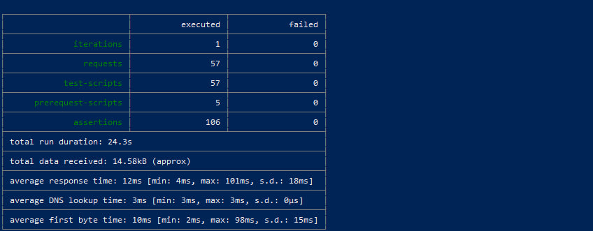

# Полный E2E-тест

Коллекция проверяет основной функционал всех восьми микросервисов на стенде, установленном командой `make install`.

## Файлы

- `electronics-store.postman_collection.json` — коллекция запросов и проверок.
- `electronics-store.postman_environment.json` — окружение с адресом стенда, учетными данными администратора и переменными сценария.

Исходные значения окружения:

| Переменная | Значение | Назначение |
|---|---|---|
| `baseUrl` | `http://electronics.store` | Адрес приложения |
| `adminLogin` | `admin` | Логин администратора |
| `adminPassword` | `Admin123!` | Пароль администратора |
| `depositAmount` | `500000` | Сумма пополнения баланса |

Остальные переменные автоматически создаются и заполняются во время выполнения коллекции.

## Что проверяется

1. Доступность приложения и начальные данные каталога.
2. Регистрация, вход пользователя и вход администратора.
3. Профиль покупателя и его адреса.
4. Бренды, категории и товары каталога.
5. Работа кэша каталога в Redis.
6. Остатки товаров на складе.
7. Зоны и интервалы доставки.
8. Пополнение и проверка баланса.
9. Успешное создание заказа и выполнение Saga.
10. Отклонение заказа при отсутствии товара и компенсация Saga.
11. Идемпотентность создания заказа.
12. Проверка доступа к защищенным операциям.
13. Создание и чтение уведомлений.

## Подготовка стенда

Откройте WSL в корне репозитория и установите полный стенд:

```bash
cd "./Проектная работа/K8s"
make install
```

В отдельном окне WSL оставьте запущенным проброс Traefik:

```bash
sudo KUBECONFIG=/home/mapa/.kube/config \
kubectl port-forward --address 0.0.0.0 -n m svc/traefik 80:80
```

В файле `C:\Windows\System32\drivers\etc\hosts` должна присутствовать строка:

```text
127.0.0.1 electronics.store
```

## Запуск

Откройте PowerShell в корне репозитория:

```powershell
cd ".\Проектная работа\Postman\Main"

newman run .\electronics-store.postman_collection.json `
  -e .\electronics-store.postman_environment.json `
  --delay-request 300 `
  --reporters cli
```

Повторный запуск не требует очистки данных: коллекция формирует уникальные имена и идентификаторы тестовых сущностей.

## Результат контрольного запуска

- итераций: 1;
- HTTP-запросов: 57;
- проверок: 106;
- ошибок: 0;
- длительность: 24,3 секунды;
- среднее время ответа: 12 мс.


