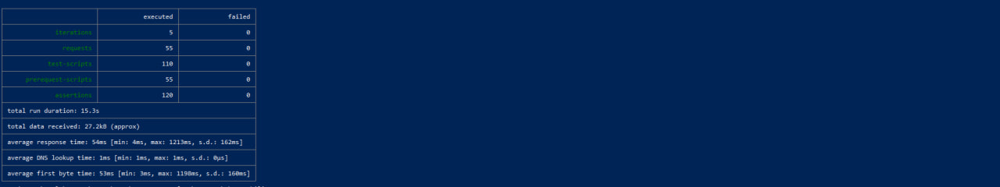
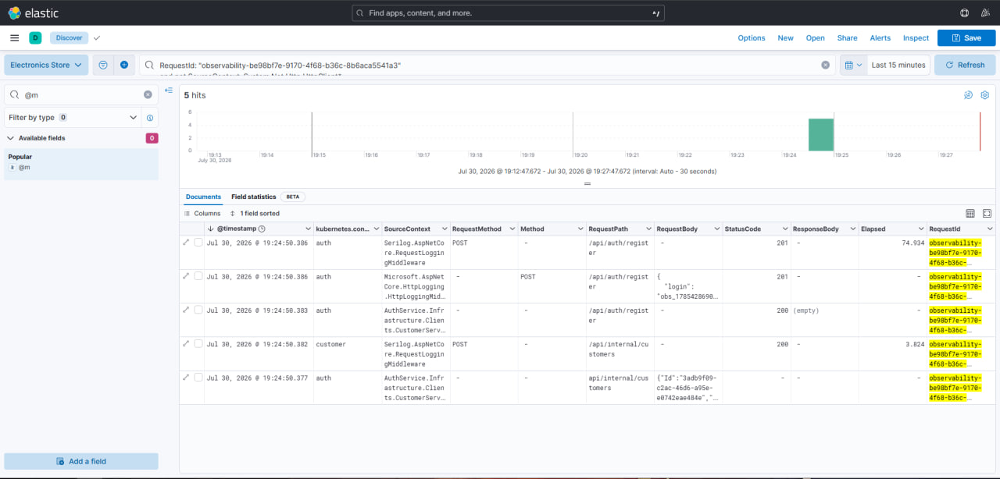
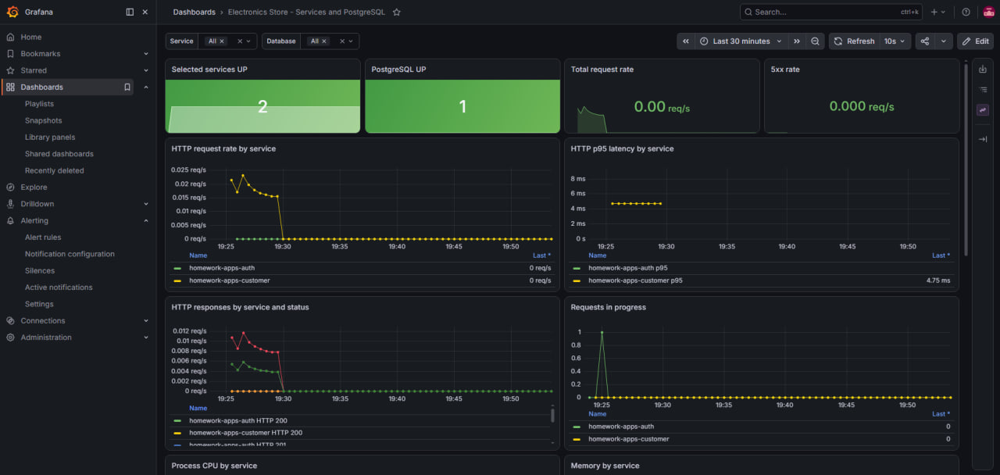
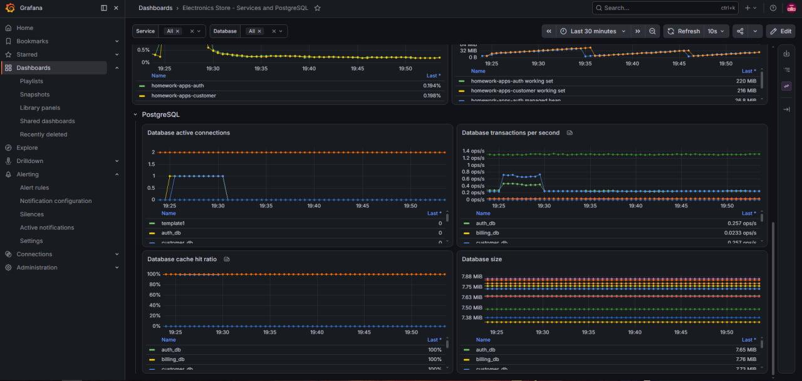

# Проверка наблюдаемости

Коллекция создает нагрузку на Auth и Customer на demo-стенде, чтобы результаты запросов можно было увидеть в централизованных логах Kibana и на дашборде Grafana.

## Файлы

- `electronics-store-observability.postman_collection.json` — коллекция запросов и проверок.
- `electronics-store-observability.postman_environment.json` — окружение с адресом стенда и автоматически заполняемыми переменными.

Начальное значение `baseUrl` — `http://electronics.store`. Остальные переменные коллекция формирует во время запуска.

## Что проверяется

1. Регистрация пользователя и внутренний запрос Auth к Customer.
2. Вход пользователя.
3. Получение и изменение профиля.
4. Создание, получение, изменение и удаление адреса.
5. Ожидаемая ошибка `500`, создающая запись уровня Error для Kibana.
6. Ответ `401` на запрос профиля без токена.
7. Ответ `404` для отсутствующего адреса.

Каждый запрос получает уникальный заголовок `X-Request-ID`. Newman выводит его строкой `Kibana RequestId [...]`, поэтому выполнение конкретного запроса можно найти в Kibana.

## Подготовка стенда

Откройте WSL в корне репозитория и установите demo-стенд:

```bash
cd "./Проектная работа/K8s"
make install-demo
```

В отдельном окне WSL оставьте запущенным проброс Traefik:

```bash
sudo KUBECONFIG=/home/mapa/.kube/config \
kubectl port-forward --address 0.0.0.0 -n m svc/traefik 80:80
```

В файле `C:\Windows\System32\drivers\etc\hosts` должна присутствовать строка:

```text
127.0.0.1 electronics.store
```

## Запуск

Откройте PowerShell в корне репозитория. Пять итераций дают достаточно данных для графиков Grafana:

```powershell
cd ".\Проектная работа\Postman\Observability"

newman run .\electronics-store-observability.postman_collection.json `
  -e .\electronics-store-observability.postman_environment.json `
  --iteration-count 5 `
  --delay-request 100 `
  --reporters cli
```

## Результат контрольного запуска

- итераций: 5;
- HTTP-запросов: 55;
- проверок: 120;
- ошибок: 0;
- длительность: 15,3 секунды;
- среднее время ответа: 54 мс.



## Просмотр логов в Kibana

В отдельном окне WSL запустите:

```bash
kubectl port-forward --address 0.0.0.0 \
  -n monitoring svc/kibana 5601:5601
```

1. Откройте `http://localhost:5601`.
2. Перейдите в **Discover**.
3. Нажмите **Open** и выберите сохраненный поиск **Electronics Store - Request trace**.
4. Установите период **Last 15 minutes**.
5. Чтобы увидеть ход одного запроса, скопируйте его идентификатор из вывода Newman и введите:

```text
RequestId: "observability-..."
```

В таблице отображаются сервис, источник сообщения, HTTP-метод, путь, тело запроса, код ответа, тело ответа, время выполнения и Request ID. Для регистрации с одним Request ID видны внешний запрос к Auth и внутренний запрос Auth к Customer.



## Просмотр метрик в Grafana

В отдельном окне WSL запустите:

```bash
kubectl port-forward --address 0.0.0.0 \
  -n monitoring svc/monitoring-grafana 3000:80
```

1. Откройте `http://localhost:3000`.
2. Войдите с логином `admin` и паролем `admin`.
3. Откройте **Dashboards → Electronics Store - Services and PostgreSQL**.
4. Выберите период **Last 30 minutes** и нажмите **Refresh**.

В верхней части дашборда отображаются доступность сервисов и PostgreSQL, интенсивность запросов, коды ответов, P95, активные запросы, CPU и память.



В секции **PostgreSQL** отображаются соединения, транзакции, cache hit ratio и размеры баз данных.


