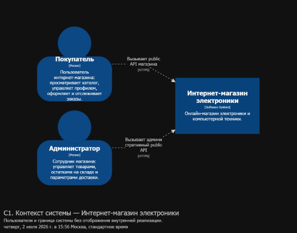
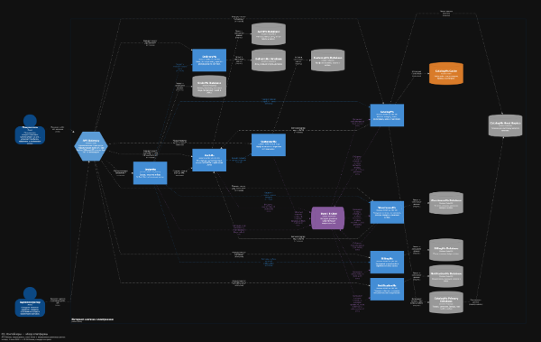
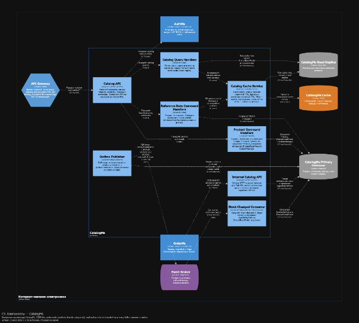
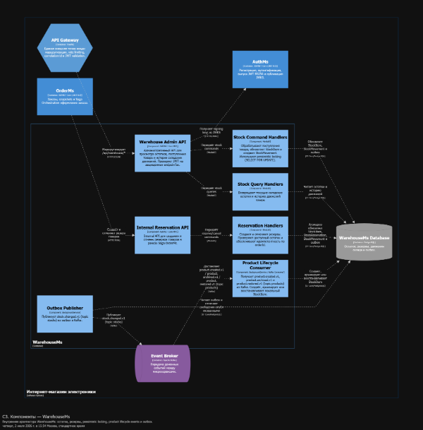
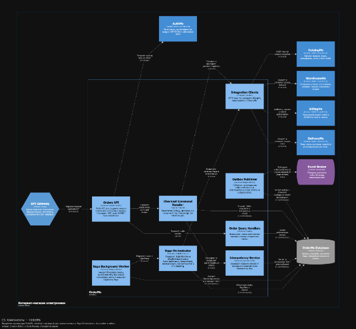

# Архитектура интернет-магазина электроники

В разделе собрана архитектурная документация выпускного проекта: C4-модель системы, описание микросервисов и API Gateway, а также sequence-диаграммы основных взаимодействий.

## Архитектурный подход

Система разделена на микросервисы по бизнес-возможностям. Каждый сервис владеет своей моделью и логической базой данных, самостоятельно валидирует JWT и предоставляет собственные health checks и метрики.

Для взаимодействия используются два подхода:

- **HTTP/JSON** — синхронные запросы, когда результат нужен для продолжения текущей операции;
- **Apache Kafka** — асинхронная доставка интеграционных событий.

Публичный трафик проходит через **Traefik API Gateway**. Внутренние `/api/internal/*` endpoints доступны только сервисам внутри Kubernetes.

Согласованность распределённых операций обеспечивают:

- Saga Orchestration в OrderService;
- компенсирующие операции Billing, Warehouse и Delivery;
- Transactional Outbox для надёжной публикации событий;
- Inbox и идемпотентные обработчики для защиты от повторной доставки;
- Idempotency Key для повторного создания заказа.

## Модули системы

| Модуль | Архитектурная роль | Взаимодействие |
|---|---|---|
| **API Gateway** | Единая публичная точка входа | Маршрутизация, rate limiting, `X-Request-ID`, access logs |
| **AuthMs** | Identity provider системы | JWT RS256, JWKS, Customer HTTP API, события пользователей |
| **CustomerMs** | Владелец профиля и адресов клиента | AuthMs, события клиентов |
| **CatalogMs** | Владелец товарной карточки и витрины | Read replica, Redis, WarehouseMs, OrderMs |
| **WarehouseMs** | Владелец остатков и товарных резервов | CatalogMs, OrderMs, Kafka |
| **OrderMs** | Оркестратор оформления заказа | CatalogMs, BillingMs, WarehouseMs, DeliveryMs |
| **BillingMs** | Владелец счетов и платёжных операций | Auth events, OrderMs |
| **DeliveryMs** | Владелец зон, слотов и резервов доставки | OrderMs |
| **NotificationMs** | Проекция уведомлений пользователя | Customer и Order events |
| **Kafka** | Шина интеграционных событий | Асинхронная связь микросервисов |
| **PostgreSQL** | Персистентность сервисов | Отдельная логическая БД на микросервис |
| **Redis** | Кэш read-heavy операций CatalogMs | Cache-Aside и distributed lock |

Подробное внутреннее устройство каждого микросервиса вынесено в раздел [MS](./MS/).

## C4-модель

Исходная Structurizr DSL-модель находится в каталоге [C4](./C4/). Модель разделена на общую платформу, связи, компонентные представления и views.

### C1 — контекст системы



### C2 — контейнеры платформы



### Компоненты CatalogMs



### Компоненты WarehouseMs



### Компоненты OrderMs



## Запуск Structurizr

Требуется Docker Desktop и образ `structurizr/structurizr:latest`.

Откройте PowerShell в корне репозитория:

```powershell
cd ".\Проектная работа\Архитектура\C4"

docker run --rm -it `
  --name structurizr `
  -p 8080:8080 `
  -v "${PWD}:/usr/local/structurizr" `
  structurizr/structurizr:latest local
```

После запуска открыть:

```text
http://localhost:8080
```

Structurizr загружает модель из `C4/workspace.dsl`. Для остановки контейнера используется `Ctrl+C`.

## Документация модулей

- [API Gateway](./ApiGateway.md)
- [AuthMs](./MS/AuthMs.md)
- [CustomerMs](./MS/CustomerMs.md)
- [CatalogMs](./MS/CatalogMs.md)
- [WarehouseMs](./MS/WarehouseMs.md)
- [OrderMs](./MS/OrderMs.md)
- [BillingMs](./MS/BillingMs.md)
- [DeliveryMs](./MS/DeliveryMs.md)
- [NotificationMs](./MS/NotificationMs.md)

## Sequence-диаграммы

- [Регистрация пользователя](./Sequence/User%20Registration.md)
- [Подготовка оформления заказа](./Sequence/Checkout%20Preparation.md)
- [Успешная сага заказа](./Sequence/Order%20Saga%20Success.md)
- [Отклонённая сага и компенсации](./Sequence/Order%20Saga%20Rejected.md)
- [Синхронизация жизненного цикла товара](./Sequence/Product%20Lifecycle%20Synchronization.md)
- [Синхронизация доступности остатков](./Sequence/Stock%20Availability%20Synchronization.md)
