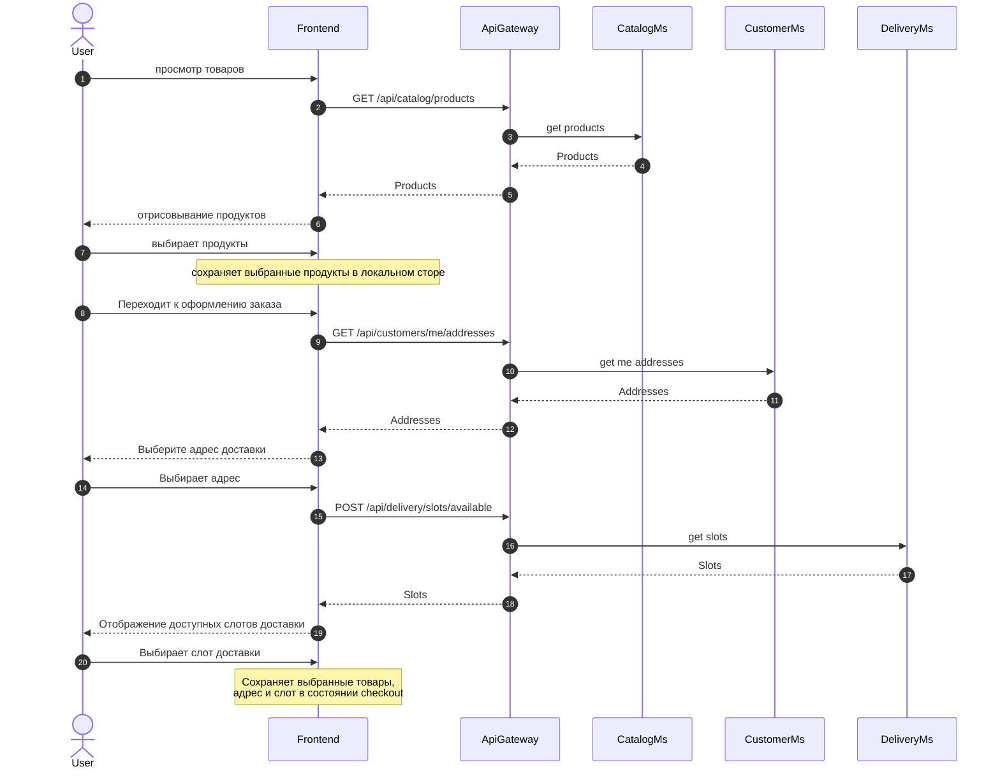

### Цель  
  
Показать, как пользователь выбирает товары, адрес и слот доставки перед созданием заказа.  
### Триггер
Пользователь открывает каталог.
### Участники 
| Участник   | Роль                                       | Основные действия                                                         |
| ---------- | ------------------------------------------ | ------------------------------------------------------------------------- |
| User       | Пользователь                               | Выбирает товары, адрес и слот доставки                                    |
| Frontend   | Клиентское приложение                      | Отображает данные и хранит состояние checkout                             |
| ApiGateway | Маршрутизирует запрос                      | Маршрутизирует запросы от Frontend к микросервисам                        |
| CatalogMs  | Владелец информации о продуктах            | Возвращает информацию о товарах                                           |
| CustomerMs | Владелец информации о адресах пользователя | Возвращает адреса пользователя                                            |
| DeliveryMs | Владелец информации о слотах доставки      | Расчитывает и возвращает слоты доставки доступные для адреса пользователя |
### Предусловия  
  
- Пользователь аутентифицирован.  
- Товары существуют и активны.  
  
### Диаграмма

### Результат  
  
- Пользователь выбрал товары, адрес и слот доставки.  
- Frontend сформировал данные для checkout.  
- Заказ ещё не создан.  
- Оплата, товар и слот доставки ещё не зарезервированы.