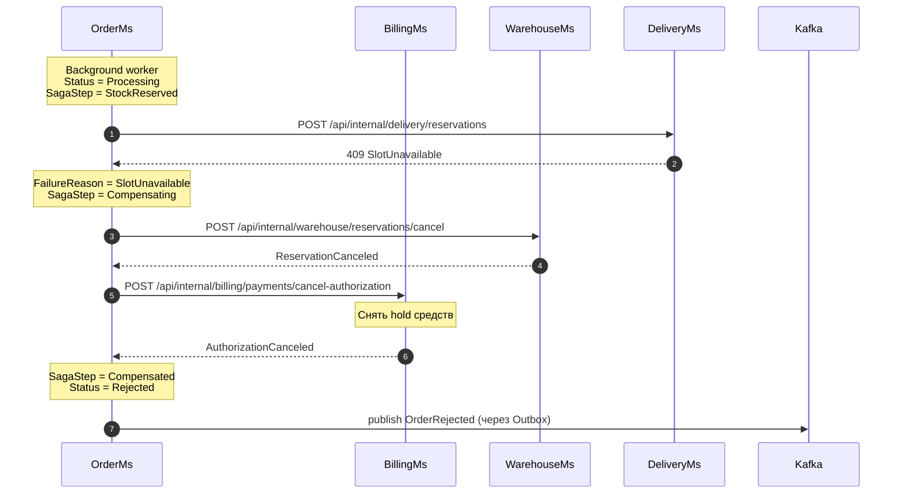

### Цель
  
Показать, как OrderMs компенсирует уже выполненные шаги Saga,  
если DeliveryMs не смог зарезервировать выбранный слот доставки.  
### Триггер
Background worker OrderMs выполняет резервирование доставки  
для заказа со статусом `Processing` и шагом `StockReserved`.
### Участники 
| Участник    | Роль             | Основные действия                                                                  |
| ----------- | ---------------- | ---------------------------------------------------------------------------------- |
| OrderMs     | Оркестратор Saga | Хранит состояния Saga, вызывает участников и контролирует компенсационный механизм |
| BillingMs   | Участник Saga    | Отменяет ранее созданную авторизацию оплаты                                        |
| WarehouseMs | Участник Saga    | Отменяет ранее созданный резерв товаров                                            |
| DeliveryMs  | Участник Saga    | Возвращает бизнес-ошибку при отсутствии места в слоте                              |
| Kafka       | Брокер сообщений | Передает финальное событие                                                         |
### Предусловия

- Пользователь ранее создал заказ через `POST /api/orders`.  
- OrderMs сохранил заказ со статусом `Processing`.  
- Product snapshot и адрес доставки уже сохранены в заказе.  
- BillingMs успешно авторизовал оплату и установил hold средств.  
- WarehouseMs успешно создал резерв товаров.  
- `SagaStep` заказа равен `StockReserved`.  
- Выбранный слот доставки к моменту резервирования стал недоступен: отсутствует свободная capacity либо слот деактивирован.
### Диаграммы

### Результат

- Слот доставки не зарезервирован.
- Резерв товара отменён.
- Hold средств отменён.
- Заказ получает статус `Rejected`.
- В Kafka опубликовано событие `OrderRejected`.