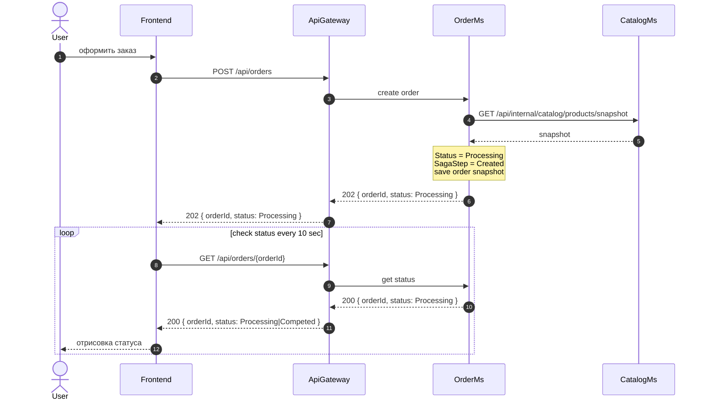
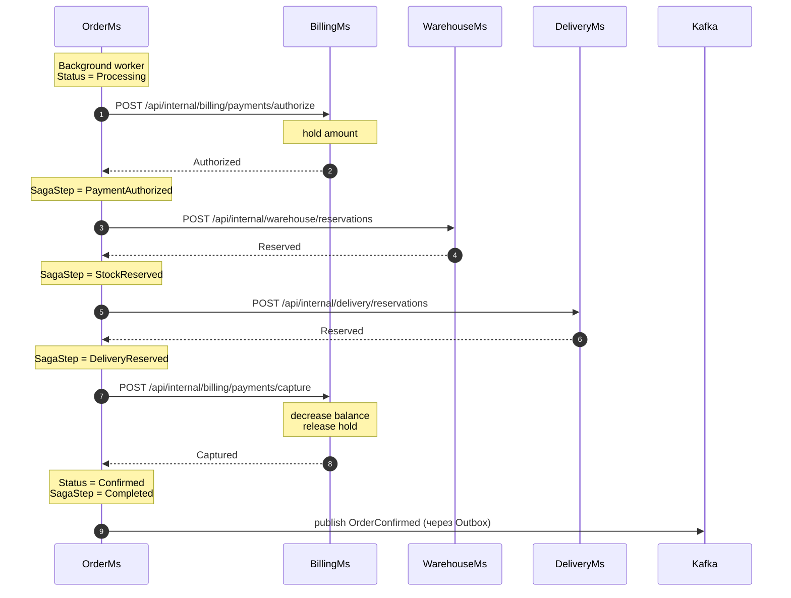

### Цель  
  
Показать, как OrderMs оркестрирует успешное оформление заказа: авторизацию оплаты, резерв товара, резерв слота доставки и публикацию итогового события.  
### Триггер
Пользователь вызывает:  

```http
POST /api/orders  
```
### Участники 
| Участник    | Роль                            | Основные действия                                          |
| ----------- | ------------------------------- | ---------------------------------------------------------- |
| User        | Пользователь                    | Создает заказ                                              |
| Frontend    | Клиентское приложение           | Отображает данные о заказе                                 |
| ApiGateway  | Маршрутизирует запрос           | Маршрутизирует запросы от Frontend к микросервисам         |
| OrderMs     | Оркестратор Saga                | Создает заказ, хранит состояния Saga и вызывает участников |
| CatalogMs   | Владелец информации о продуктах | Возвращает snapshot товаров и цен                          |
| BillingMs   | Участник Saga                   | Авторизует и списывает средства                            |
| WarehouseMs | Участник Saga                   | Резервирует товары                                         |
| DeliveryMs  | Участник Saga                   | Резервирует слот доставки                                  |
| Kafka       | Брокер сообщений                | Передает финальное событие                                 |

### Предусловия  
  
- Пользователь аутентифицирован.  
- Товары существуют и активны.  
- Пользователь выбрал адрес и слот доставки.  
- На балансе пользователя достаточно средств.  
- На складе есть товары.  
- В слоте доставки есть свободная capacity.  
  
### Диаграммы

#### Диаграмма создания заказа



#### Диаграмма Background Worker / Saga


### Результат

- Заказ получает статус `Confirmed`.
- Средства списаны.
- Товары и слот доставки зарезервированы.
- В Kafka опубликовано событие `OrderConfirmed`.