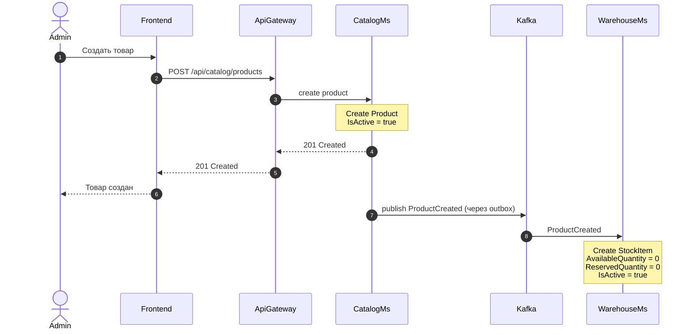
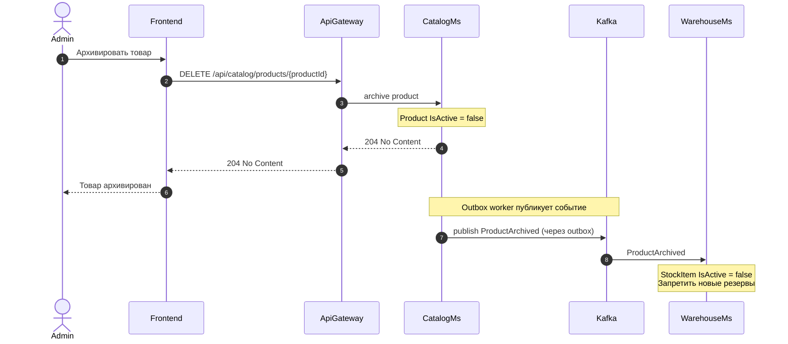
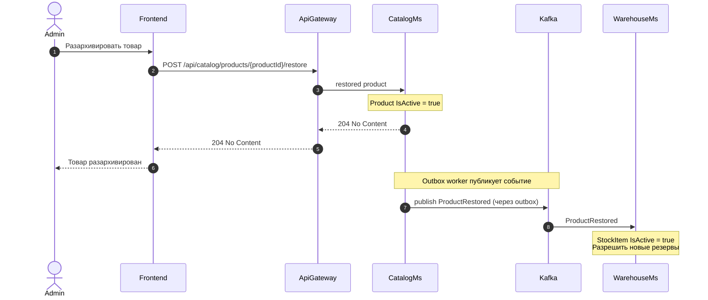

### Цель

Показать, как `CatalogMs` передаёт `WarehouseMs` информацию о создании и архивировании товара, чтобы `WarehouseMs` мог создать или деактивировать локальную складскую запись.
### Триггер

Администратор создаёт или архивирует товар в CatalogMs.
### Участники

|Участник|Роль|Основные действия|
|---|---|---|
|Admin|Администратор|Создаёт или архивирует товар|
|Frontend|Клиентское приложение|Отправляет команды управления каталогом|
|ApiGateway|Единая точка входа|Маршрутизирует запросы в CatalogMs|
|CatalogMs|Владелец товарной карточки|Создаёт и архивирует Product, публикует события|
|Kafka|Брокер сообщений|Передаёт события жизненного цикла товара|
|WarehouseMs|Владелец складских остатков|Создаёт и деактивирует локальный StockItem|
### Предусловия

- Администратор аутентифицирован и имеет роль `ADMIN`.
- Для архивирования товар существует в CatalogMs.
- Начальный остаток нового товара равен нулю.
### Диаграмма
#### Диаграмма создание товара

#### Диаграмма архивирование товара

#### Диаграмма разархивирование товара

### Результат

- После создания товара в `WarehouseMs` появляется локальный `StockItem`.
- Новый товар имеет нулевой доступный и зарезервированный остаток.
- После архивирования `WarehouseMs` запрещает новые резервы этого товара.
- После разархивирования `WarehouseMs` разрешает новые резервы этого товара. 
- `CatalogMs` остаётся источником истины для названия, цены, описания и других данных карточки товара.
- `WarehouseMs` хранит только `productId`, остатки и признак активности.