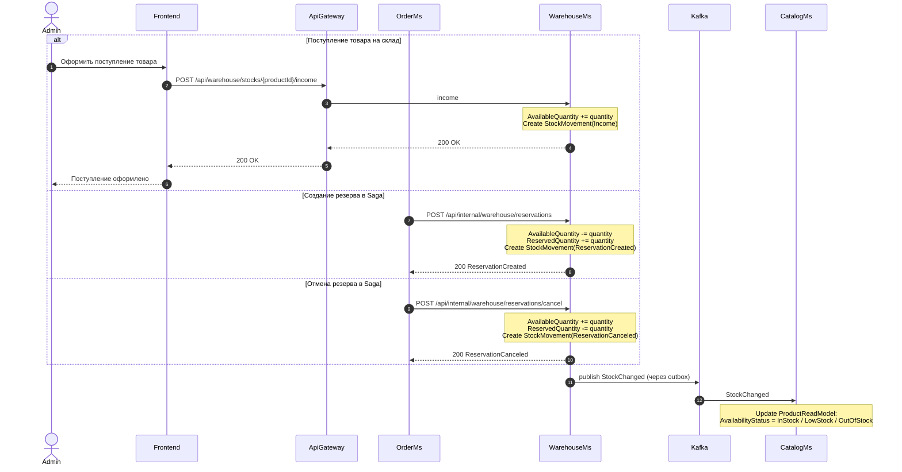

### Цель

Показать, как изменения складских остатков в `WarehouseMs` передаются в `CatalogMs`, чтобы `CatalogMs` обновлял витринный статус наличия товара.

### Триггер

Остаток товара изменяется в `WarehouseMs` после:
- поступления товара на склад;
- создания резерва товаров в рамках Saga;
- отмены резерва товаров в рамках компенсации Saga.
### Участники

|Участник|Роль|Основные действия|
|---|---|---|
|Admin|Администратор|Оформляет поступление товара на склад|
|Frontend|Клиентское приложение|Отправляет команду поступления товара|
|ApiGateway|Единая точка входа|Маршрутизирует административный запрос в WarehouseMs|
|OrderMs|Оркестратор Saga|Создаёт и отменяет резервы товаров|
|WarehouseMs|Владелец складских остатков|Изменяет остатки, создаёт движения склада и публикует `StockChanged`|
|Kafka|Брокер сообщений|Передаёт событие изменения остатка|
|CatalogMs|Владелец товарной витрины|Обновляет статус наличия товара в `ProductReadModel`|
### Предусловия
- В `WarehouseMs` существует активный `StockItem` для товара.
- В `CatalogMs` существует `ProductReadModel` для товара.
- Для создания резерва на складе достаточно доступного остатка.
- Для поступления товара запрос выполняет пользователь с ролью `ADMIN`.

### Диаграмма

> Статус наличия в `CatalogMs` является витринной информацией и может кратковременно отставать от фактического состояния из-за eventual consistency. 
### Результат
- `WarehouseMs` остаётся единственным источником истины о фактическом складском остатке.
- После каждого изменения остатка публикуется событие `StockChanged`.
- `CatalogMs` обновляет витринный `AvailabilityStatus` в `ProductReadModel`.
- Пользователь видит в каталоге статус: `InStock`, `LowStock` или `OutOfStock`.
- `CatalogMs` не принимает решение о возможности реального резерва товара.
- При оформлении заказа `OrderMs` всегда вызывает `WarehouseMs`, который выполняет окончательную проверку и резервирование.