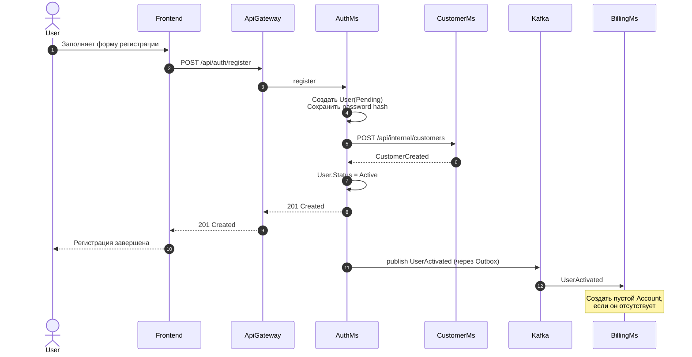

### Цель

Показать регистрацию пользователя, синхронное создание клиентского профиля в `CustomerMs` и асинхронное создание счёта в `BillingMs`.
### Триггер

Пользователь отправляет запрос:

```http
POST /api/auth/register
```
### Участники

| Участник   | Роль                      | Основные действия                                                |
| ---------- | ------------------------- | ---------------------------------------------------------------- |
| User       | Пользователь              | Вводит данные для регистрации                                    |
| Frontend   | Клиентское приложение     | Отправляет форму регистрации и отображает результат              |
| ApiGateway | Единая точка входа        | Маршрутизирует запрос в `AuthMs`                                 |
| AuthMs     | Владелец учётной записи   | Создаёт пользователя, активирует его и публикует `UserActivated` |
| CustomerMs | Владелец профиля клиента  | Синхронно создаёт профиль пользователя                           |
| Kafka      | Брокер сообщений          | Передаёт событие `UserActivated`                                 |
| BillingMs  | Владелец платёжного счёта | Асинхронно создаёт пустой счёт пользователя                      |
### Предусловия

- Логин пользователя ещё не занят.
- Данные регистрации прошли валидацию.
- `CustomerMs` доступен для синхронного создания профиля.

### Диаграмма



### Результат

- Учётная запись пользователя создана и активна.
- В `CustomerMs` создан профиль клиента.
- Пользователь может выполнить login через `POST /api/auth/login`.
- `BillingMs` получает `UserActivated` асинхронно и создаёт пустой счёт.
- Если событие ещё не обработано, счёт будет создан лениво при первом обращении в `BillingMs`.